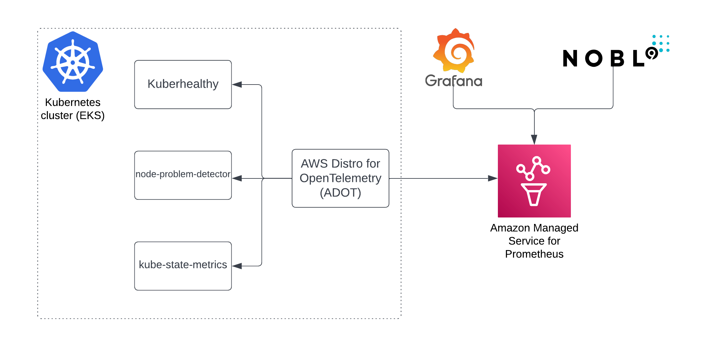

# EKG

Monitor the health of a Kubernetes cluster with ease.



Deployment of EKG with default settings on existing EKS cluster. [Amazon Managed Service for Prometheus](https://aws.amazon.com/prometheus/)
is created (optionally), and metrics are collected from [electrodes](./modules/electrodes):

- [kube-state-metrics](modules/electrodes/kube-state-metrics/README.md) - metrics for the health of the various objects inside, such as
    deployments, nodes and pods
- [node-problem-detector](modules/electrodes/node-problem-detector/README.md) - metrics for the health of the node e.g. infrastructure daemon
    issues: ntp service down, hardware issues e.g. bad CPU, memory or disk, kernel issues e.g. kernel deadlock, corrupted file system, container
    runtime issues e.g. unresponsive runtime daemon
- [Kuberhealthy](modules/electrodes/kuberhealthy/README.md) - metrics for the health of the cluster, performs synthetic tests that ensures daemonsets,
    deployments can be deployed, DNS resolves names, etc.

are sent to it by
[AWS Distro for OpenTelemetry (ADOT)](https://aws-otel.github.io/). It collects metrics exposed by other services too,
thus it can be the only thing you need to collect all of the application metrics from a cluster.

The repository gives fine-grain control over what can be deployed or reused. For instance, you can install only
chosen electrodes, or all of them, reuse existing Amazon Managed Service for Prometheus, or install only ADOT.
For details check the documentation of specific modules. Electrodes can be used with any Kubernetes cluster - EKS,
GKE, on-premise, etc.

To learn how to contribute please read [contribution guidelines](./CONTRIBUTING.md).

## End-to-end solution on fresh EKS cluster

The minimal required `terraform.tfvars` file is

```hcl
# AWS Region where your cluster is located.
aws_region = "eu-central-1"

# Name of the EKS cluster.
eks_cluster_id = "ekg-demo-xxx"
```

next just run

```sh
terraform apply
```

in the root of this repository.

Output of the above is

```sh
Apply complete! Resources: 23 added, 0 changed, 0 destroyed.

Outputs:

amp_ws_endpoint = "https://aps-workspaces.eu-central-1.amazonaws.com/workspaces/ws-ec700b72-6a7a-4367-9dea-0dd2f0e943d3/"
```

The `amp_ws_endpoint` is a URL for [Amazon Managed Service for Prometheus](https://aws.amazon.com/prometheus/) that can be
directly used for instance in [Grafana](https://grafana.com/) or [Nobl9](https://www.nobl9.com/). Deploying Grafana or
other visualization tools is not in the scope of this project.

All electrodes are deployed and metrics are collected from them.

There is the option to reuse Amazon Managed Service for Prometheus instance, add its id to
`terraform.tfvars` as `managed_prometheus_workspace_id`. To learn more about other parameters check below detailed documentation.

<!-- BEGIN_TF_DOCS -->
## Requirements

No requirements.

## Providers

| Name | Version |
|------|---------|
| <a name="provider_aws"></a> [aws](#provider\_aws) | 4.56.0 |
| <a name="provider_kubernetes"></a> [kubernetes](#provider\_kubernetes) | 2.18.1 |

## Modules

| Name | Source | Version |
|------|--------|---------|
| <a name="module_adot_amp"></a> [adot\_amp](#module\_adot\_amp) | ./modules/adot-amp | n/a |
| <a name="module_electrodes"></a> [electrodes](#module\_electrodes) | ./modules/electrodes | n/a |

## Resources

| Name | Type |
|------|------|
| [kubernetes_namespace.this](https://registry.terraform.io/providers/hashicorp/kubernetes/latest/docs/resources/namespace) | resource |
| [aws_eks_cluster.this](https://registry.terraform.io/providers/hashicorp/aws/latest/docs/data-sources/eks_cluster) | data source |
| [aws_eks_cluster_auth.this](https://registry.terraform.io/providers/hashicorp/aws/latest/docs/data-sources/eks_cluster_auth) | data source |

## Inputs

| Name | Description | Type | Default | Required |
|------|-------------|------|---------|:--------:|
| <a name="input_aws_region"></a> [aws\_region](#input\_aws\_region) | AWS Region | `string` | n/a | yes |
| <a name="input_create_namespace"></a> [create\_namespace](#input\_create\_namespace) | Namespace speciefed by variable namespace will be created, if not exists | `bool` | `true` | no |
| <a name="input_eks_cluster_id"></a> [eks\_cluster\_id](#input\_eks\_cluster\_id) | Name of the EKS cluster | `string` | n/a | yes |
| <a name="input_managed_prometheus_workspace_id"></a> [managed\_prometheus\_workspace\_id](#input\_managed\_prometheus\_workspace\_id) | Amazon Managed Service for Prometheus Workspace IDAmazon Managed Service for Prometheus Workspace ID (when nothing passed new will be created) | `string` | `""` | no |
| <a name="input_namespace"></a> [namespace](#input\_namespace) | Namespace where electrodes will be installed | `string` | `"ekg-monitoring"` | no |
| <a name="input_tags"></a> [tags](#input\_tags) | Additional tags (e.g. `map('BusinessUnit`,`XYZ`) | `map(string)` | `{}` | no |

## Outputs

| Name | Description |
|------|-------------|
| <a name="output_amp_ws_endpoint"></a> [amp\_ws\_endpoint](#output\_amp\_ws\_endpoint) | Amazon Managed Prometheus endpoint |
<!-- END_TF_DOCS -->
